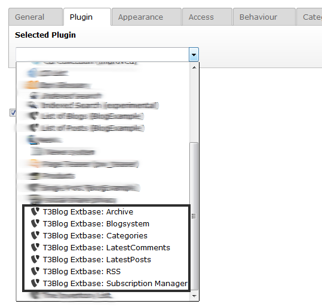

.. ==================================================
.. FOR YOUR INFORMATION
.. --------------------------------------------------
.. -*- coding: utf-8 -*- with BOM.

.. include:: ../Includes.txt

.. _admin-manual:

Administrator Manual
====================

Output
----------

Insert Plugin
^^^^^^^^^^

The output is managed via conentet modules. This means easy and flexible usage.

1. Insert a content element, choose "plugins" -> "generell plugins"

.. figure:: ../Images/AdministratorManual/plugin.png
	:width: 652px
	:alt: insert plugin

	Insert plugin

Choose one or more of the plugins listed to build your blog. These can be distributed to different columns.

	Modules

Plugins
^^^^^^^^^^

Archive
""""""""""

Simple list of your blogposts, categorised by month, sorted by date.

.. figure:: ../Images/AdministratorManual/archive.png
	:width: 260px
	:alt: archive

	Archive

Blogsystem
""""""""""

Main part of the extension. Lists all your blogposts and shows some additional information like date of publishing, name of autor, categories, number of comments.

.. figure:: ../Images/AdministratorManual/blogsystem.png
	:width: 502px
	:alt: blogsystem

	Blogsystem

Categories
""""""""""

lists the blogcategories

.. figure:: ../Images/AdministratorManual/blogcats.png
	:width: 145px
	:alt: categories

	Categories

LatestComments
""""""""""

List of the latest comments

LastestPosts
""""""""""

List of the latest blogpost

.. figure:: ../Images/AdministratorManual/latestposts.png
	:width: 201px
	:alt: latestposts

	Lastest posts

RSS
""""""""""

RSS output, see chapter RSS (its a bit special)

Subscription Manager
""""""""""

see chapter Subscription Manager!

Subscription Manager
^^^^

.. important::

	Use a separate page for this plugin!

Don´t forget to include the static template "T3Blog Extbase: Subscription Manager" an that page

This plugin manages blog post subscriptions. All email links will point to this page.

Configure the Subscription manager via TS (see t3extblog\Configuration\TypoScript\setup.txt, look for "subscriptionManager"!

RSS
^^^^

The RSS-Module need some special treatment, but no need to worry.

Just create a single page for the RSS-output, then

1. Choose the rss-modul and insert it to that page (see above how to do this)
2. Create an extension template and include „T3Extblog: Rss setup (t3extblog)

.. figure:: ../Images/AdministratorManual/rssincludestatic.png
	:width: 689px
	:alt: RSS include static

	RSS

When you open the page, the output should look like this:

.. figure:: ../Images/AdministratorManual/rssoutput.png
	:width: 609px
	:alt: RSS output

	RSS Output

Have a look at /Configuration/TypoScript/RSS/setup.txt
You can override the values by using an extension template on the page where your have insert the Rss-modul.

When you want to use RealURL add the static template "T3Extblog: additional RealUrl config (t3extblog)" too. When overriding the TS-values, add a
"config.tx_realurl_enable = 1" to your TS to get RealUrl running in the RSS-Feed.
