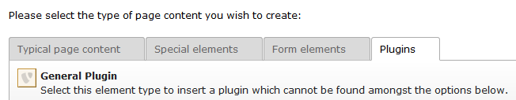
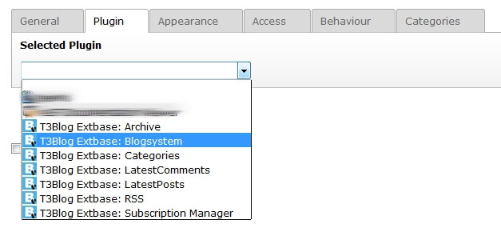
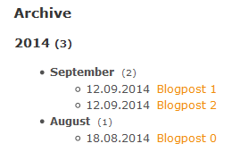
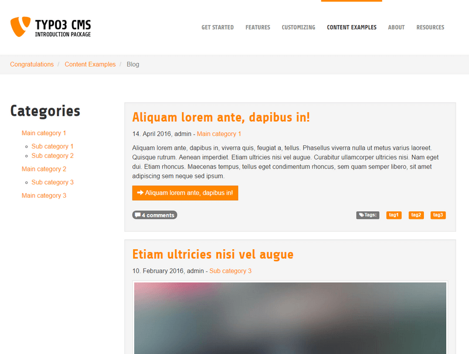
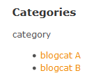
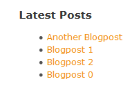
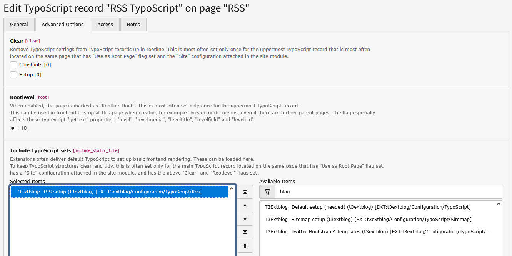
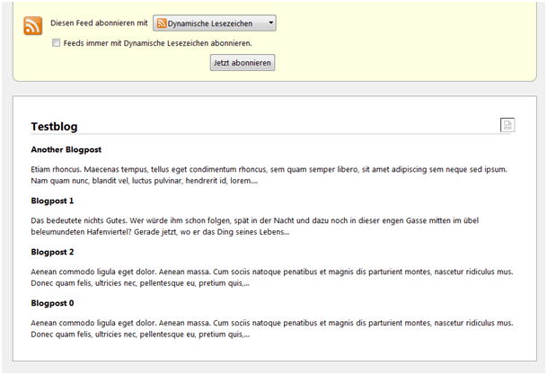

.. ==================================================
.. FOR YOUR INFORMATION
.. --------------------------------------------------
.. -*- coding: utf-8 -*- with BOM.

.. include:: ../Includes.txt

.. _admin-manual:

Administrator Manual
====================

Target group: **Administrators**

.. only:: html

	.. contents:: Within this page
		:local:
		:depth: 3

Insert Plugin
-------------

The output is managed via content modules. This means easy and flexible usage.

1. Insert a content element, choose "Plugins" -> "General Plugin"

	Insert plugin

Choose one or more of the plugins listed to build your blog. These can be distributed to different columns.

	Modules

Plugins
-------

Archive
^^^^^^^

Simple list of your blogposts, categorised by month, sorted by date.

	Archive

Blogsystem
^^^^^^^^^^

Main part of the extension (we´ve added this while installing this extension already).
Lists all your blogposts and shows some additional information like date of publishing,
name of author, categories, number of comments.

	Blogsystem

Categories
^^^^^^^^^^

List all blog categories including sub categories.

	Categories

Latest Comments
^^^^^^^^^^^^^^^

List of the latest comments. Configurable via :code:`paginate` settings.

Lastest Posts
^^^^^^^^^^^^^

List of the latest blog posts. Configurable via :code:`paginate` settings.

	Lastest posts

RSS Feed
^^^^^^^^

RSS output, see chapter RSS.

Subscription Manager
^^^^^^^^^^^^^^^^^^^^

.. _administration-subscription-manager:

This plugin manages all blog related subscriptions. All email links will point to this page.
Depending on your configuration users can confirm, add and remove subscriptions for new comments and new posts.

We've already did some basic settings for this plugin in the installation process, but you should do so some more configuration.

Configure the Subscription manager via with (see :code:`t3extblog\Configuration\TypoScript\setup.txt`, look for "subscriptionManager"!

.. important::

	Use a separate page for this plugin!

.. tip::

	More information about email sending in the :ref:`Users Manual <users-manual-notifications>`

Blog Subscription Form
^^^^^^^^^^^^^^^^^^^^^^

.. _administration-blog-subscription-form:

This plugin provides as simple form which enables users to subscribe for new blog posts. Uses opt-in emails for confirmation.

Configure the Subscription manager form with TS (see :code:`t3extblog\Configuration\TypoScript\setup.txt`, look for "blogSubscription"!

RSS Feed
--------

.. _administration-rss:

The RSS-Module need some special treatment, but no need to worry.

Just create a single page for the RSS-output, then

1. Choose the RSS plugin and insert it to that page (see above how to do this)
2. Create an extension template and include `T3Extblog: Rss setup (t3extblog)`

	RSS

When you open the page, the output should look like this:

	RSS Output

Have a look at :code:`/Configuration/TypoScript/RSS/setup.txt`
You can override the values by using an extension template on the page where your have insert the Rss-modul.

When you want to use RealURL add the static template `T3Extblog: additional RealUrl config (t3extblog)` too.
When overriding the TS-values, add a :code:`config.tx_realurl_enable = 1` to your TS to get RealUrl running in the RSS-Feed.

.. important::
	Please note: Default RSS template depends on using RealUrl.
	You will need to escape links when using plain TYPO3 links.

Preview blog posts
------------------

The extension has a preview functionality. Add following TypoScript to your page TSconfig (where 123 is the PID of
the page where the blogsystem is included).

.. code-block:: typoscript

	# TYPO3 <= 6.2
	tx_t3extblog.singlePid = 123

	# TYPO3 >= 7.2
	TCEMAIN.preview {
		tx_t3blog_post {
			previewPageId = 123
			useDefaultLanguageRecord = 1
			fieldToParameterMap {
				uid = tx_t3extblog_blogsystem[previewPost]
			}
			additionalGetParameters {
				tx_t3extblog_blogsystem.controller = Post
				tx_t3extblog_blogsystem.action = preview
			}
		}
	}

By default, hidden posts are only visible to authenticated backend users. This is done by TypoScript
(:code:`settings.previewHiddenRecords`), please see :code:`/Configuration/TypoScript/setup.txt`.

Multilanguage / Localization
----------------------------

**Requirements:**

Working multi language TYPO3 CMS installation.

**Needed steps:**

* Translate blogsystem plugin page

* Translate plugin elements

* Translate record sysfolder

* Start translating your posts and categories!

**Email localization**

All emails (subscription opt-in, new comment notify for admin and user) are single language only at the moment.

.. important::
	Please note: Added localization strings will work in frontend but not in backend. It's recommended to only use and
	change the default localization to keep all emails consistent.

Please see here for more information: https://github.com/fnagel/t3extblog/issues/68