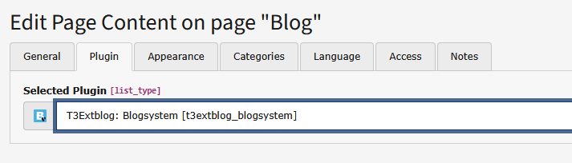

.. ==================================================
.. FOR YOUR INFORMATION
.. --------------------------------------------------
.. -*- coding: utf-8 -*- with BOM.

.. include:: ../Includes.txt

.. _admin-manual:

Administrator Manual
====================

Target group: **Administrators**

.. contents:: Within this page
   :local:
   :depth: 3

Insert Plugin
-------------

The output is managed via content modules. This means easy and flexible usage.

1. Insert a content element, choose "Plugins" -> "General Plugin"

.. figure:: ../Images/AdministratorManual/plugin.png
	:alt: Insert plugin
   :class: with-shadow

Choose one or more of the plugins listed to build your blog. These can be distributed to different columns.

Plugins
-------

Blogsystem
^^^^^^^^^^

Main plugin of the extension. Provides post list and detail view. Enables users to create comments.

.. figure:: ../Images/AdministratorManual/blogsystem.png
	:alt: Blogsystem
   :class: with-shadow

Archive
^^^^^^^

This plugin displays a list of your blog posts, nested by month and sorted by date.

.. figure:: ../Images/AdministratorManual/archive.png
	:alt: Archive
   :class: with-shadow

Categories
^^^^^^^^^^

List all blog categories including sub categories.

Latest Comments
^^^^^^^^^^^^^^^

List of the latest comments. Configurable via :code:`paginate` settings.

Latest Posts
^^^^^^^^^^^^

List of the latest blog posts. Configurable via :code:`paginate` settings.

RSS Feed
^^^^^^^^

RSS output, see chapter RSS.

Subscription Manager
^^^^^^^^^^^^^^^^^^^^

.. _administration-subscription-manager:

This plugin manages all blog related subscriptions. All email links will point to this page.
Depending on your configuration users can confirm, add and remove subscriptions for new comments and new posts.

.. figure:: ../Images/AdministratorManual/subscription-manager.png
	:alt: Subscription Manager
   :class: with-shadow

We've already did some basic settings for this plugin in the installation process, but you should do so some more configuration.

Configure the Subscription manager via with (see :code:`/Configuration/TypoScript/Includes/Settings/SubscriptionManager.typoscript`).

.. important::

	Use a separate page for this plugin!

.. tip::

	More information about email sending in the :ref:`Users Manual <users-manual-notifications>`

Blog Subscription Form
^^^^^^^^^^^^^^^^^^^^^^

.. _administration-blog-subscription-form:

This plugin provides a simple form which enables users to subscribe for new blog posts. Uses opt-in emails for confirmation.

Configure the Subscription manager form with TS (see :code:`/Configuration/TypoScript/Includes/Settings/BlogSubscription.typoscript`).

RSS Feed
--------

.. _administration-rss:

This plugin renders a RSS feed.

The RSS-Module need some special treatment, but no need to worry. Just create a single page for the RSS-output, then:

1. Choose the RSS plugin and insert it to that page (see above how to do this)
2. Create an extension template and include `T3Extblog: Rss setup (t3extblog)`

.. figure:: ../Images/AdministratorManual/rssincludestatic.png
	:alt: RSS include static
   :class: with-shadow

When you open the page, the output should look like this:

.. figure:: ../Images/AdministratorManual/rssoutput.png
	:alt: RSS output
   :class: with-shadow

Have a look at :code:`/Configuration/TypoScript/RSS/setup.typoscript`
You can override the values by using an extension template on the page where your have insert the Rss-modul.

.. important::
	Please note: Default RSS template depends on using speaking URLs.
	You will need to escape links when using plain TYPO3 links.

Preview blog posts
------------------

The extension has a preview functionality. Add following TypoScript to your page TSconfig (where 123 is the PID of
the page where the blogsystem plugin is included).

.. code-block:: typoscript

	TCEMAIN.preview {
		tx_t3blog_post {
			previewPageId = 123
			useDefaultLanguageRecord = 1
			fieldToParameterMap {
				uid = tx_t3extblog_blogsystem[previewPost]
			}
			additionalGetParameters {
				tx_t3extblog_blogsystem.controller = Post
				tx_t3extblog_blogsystem.action = preview
			}
		}
	}

By default, hidden posts are only visible to authenticated backend users.

Multilanguage / Localization
----------------------------

**Requirements:**

Working multi language TYPO3 CMS installation.

**Needed steps:**

* Translate blog related page

* Translate plugin elements

* Translate record sysfolder

* Translate post and category records

**Email localization**

All emails (post and blog subscription opt-in, new comment notify for admin and user) can be fully localized.

.. important::
	Please note: due to a core bug (https://forge.typo3.org/issues/108102) it is needed to always add the `languageKey`
   argument with the `languageCode` value when using the translate VH: `<f:translate languageKey="{locale.languageCode}" />`
   Using the Local object directly will result in wrong localization!
