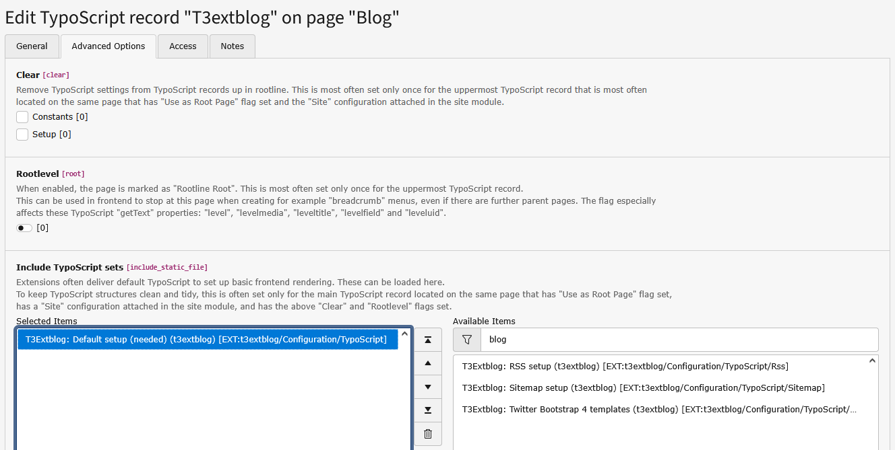

.. ==================================================
.. FOR YOUR INFORMATION
.. --------------------------------------------------
.. -*- coding: utf-8 -*- with BOM.

.. include:: ../Includes.txt

.. _installation:

Installation
====================

The installation is quite simple. Just follow the instructions below.

1. Import and install the extension via the extension manager
2. Include static (this can be done in your root template or in an extension template corresponding to your blog in the pagetree. At least you have to include "T3Extblog: Default Setup (needed) (t3extblog)". When using RealURL you should include "T3Extblog: additional RealUrl config (t3extblog)".

	Include static

3. Now go to the constant editor and insert the default storage pid (i.e. the sysfolder where you want to store your blog-entries. 133 is just an expample!)

.. figure:: ../Images/Installation/contanteditor.png
	:width: 609px
	:alt: contant editor

	constant editor

4. Now add this line to your template-setup: **plugin.tx_t3extblog.settings.blogsystem.pid = 123** (123 is the pageid where the modul „blogsystem“ will be.