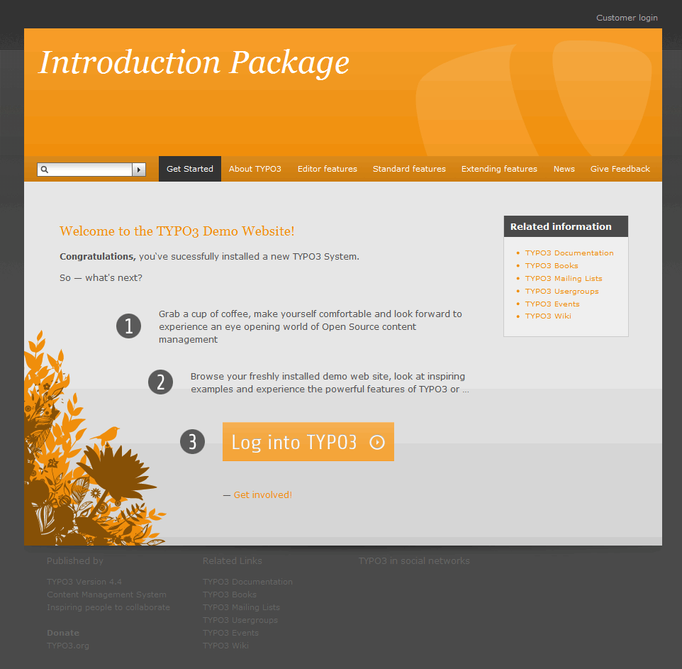

.. ==================================================
.. FOR YOUR INFORMATION
.. --------------------------------------------------
.. -*- coding: utf-8 -*- with BOM.

.. include:: ../Includes.txt

What does it do?
================

First of all, if you have any idea how this template can be improved, please, drop a note to our team_. Documentation is written in reST format. Please, refer to Help writing reStructuredText to get some insight regarding syntax and existing reST editors on the market.

.. _team: http://forge.typo3.org/projects/typo3v4-official_extension_template/issues

Here should be given a brief overview of the extension. What does it do? What problem does it solve? Who is interested in this? Basically the document includes everything people need to know to decide, if they should go on with this extension.

	Introduction Package just after installation (caption of the image)

	How the Frontend of the Introduction Package looks like just after installation (legend of the image)
