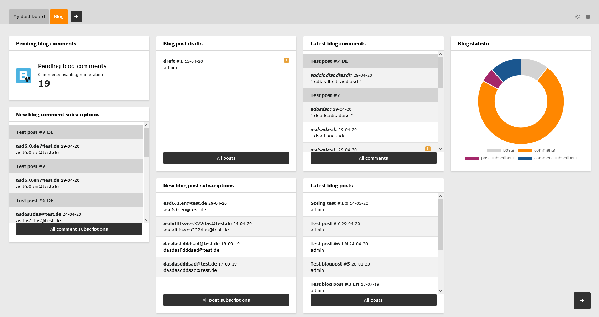

.. ==================================================
.. FOR YOUR INFORMATION
.. --------------------------------------------------
.. -*- coding: utf-8 -*- with BOM.

.. include:: ../Includes.txt

.. contents:: Within this page
   :local:
   :depth: 3

What does it do?
================

A record based blog extension for TYPO3 CMS. Easy to use and packed with features. Flexible and powerful!

Currently implemented features:

**General**

* Blog system with posts, categories, tags, comments and subscriptions
* Use all TYPO3 content elements within your blog posts
* BE Module with dashboard and lists for posts, comments and subscriptions
* Multiple core dashboard widgets
* Views: list, detail, latest, categories, archive, latest posts and comments (each is a FE plugin)
* Filter posts by category, tag or author
* Fields for preview text and image in list view
* RSS feed for posts
* Preview of hidden posts (drafts)
* Multi language support
* Link validator support
* Speaking URLs support
* Sitemap support

**Comments and subscriptions**

* Subscriptions for new comments and new blog posts
* Wordpress like subscription manager (manage all subscriptions from a dashboard)
* Opt-In mails for subscriptions with configurable expiration date
* Configurable SPAM check: "I am human" checkbox, honeypot, cookie and user agent check, link count
* Using TYPO3 core alike rate limiter implementation for throttling requests as additional SPAM check
* Email address for comments is optional (but will be enforced if subscription checkbox is enabled)
* Pre-fill comment author and email from session
* Auto close comments functionality
* Allow some HTML tags in comment message
* GDPR / DSGVO checkboxes
* Reasonable email sending, even when you accept comments in BE (extension module AND default list module, using TCEMAIN hooks)
* Send HTML and / or text emails

**Developer related**

* Reasonable cache handling (using cache tags)
* Default HTML markup matches Twitter Bootstrap 3.x or 4.x
* Using official TYPO3 localization tools (Crowdin, see https://crowdin.com/project/typo3-extension-t3extblog)
* Using interfaces and signal / slot for easy extending
* Supports migration from EXT:t3blog and is tested in TYPO3 6-11
* CGL and code quality tests

.. tip::

	Visit & contribute: https://github.com/fnagel/t3extblog

Screenshots
===========

Screenshots taken from a TYPO3 CMS instance with "Introduction package" (EXT:introduction using
EXT:bootstrap_package extension) and T3extblog installed.

Frontend
--------

**Blogsystem**

.. figure:: ../Images/AdministratorManual/blogsystem.png
	:alt: Blogsystem

**Comment form**

.. figure:: ../Images/Screenshots/comment.png
	:alt: Comment form

**Archive**

.. figure:: ../Images/AdministratorManual/archive.png
	:alt: Archive

**Subscription Manager**

.. figure:: ../Images/AdministratorManual/subscription-manager.png
	:alt: Subscription Manager

Backend
-------

**Core dashboard widgets**

**Extension module dashboard**

.. figure:: ../Images/Screenshots/dashboard.png
	:alt: Dashboard backend module

**Post records list**

.. figure:: ../Images/UserManual/module.png
	:alt: Post records backend module
