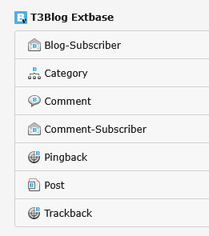

.. ==================================================
.. FOR YOUR INFORMATION
.. --------------------------------------------------
.. -*- coding: utf-8 -*- with BOM.

.. include:: ../Includes.txt

.. _users-manual:

Users manual
============

Target group: **Editors**

.. only:: html

	.. contents:: Within this page
		:local:
		:depth: 3

General information
-------------------

You can write Blogposts using the classic way: Open the folder or page you set for storagePid using the list module,
add a new record. If not done already, add at least a title and one category.

But t3extblog comes with a simple backend module. You will find it in the "WEB"-section. It looks like this:

.. figure:: ../Images/UserManual/writeblogpost.png
	:width: 600px
	:alt: Backend module

	Backend module

To write a blogpost, just click the plus-icon on the top.

Now you can start adding contents to your blogpost!

Create a blogpost
-----------------

.. figure:: ../Images/UserManual/createblogpost.png
	:width: 671px
	:alt: Create blogpost

	Create blogost

Post

- Author: is determined by the current BE user
- Title: title of your blogpost, you need to fill this field

Preview

- Preview: configure a list preview for the blog post
- There are diffrent "Preview modes", i.e. you can add your own preview text or show the first content element

Category:

- select one or more categories
- you need so select at least one category

Interactivity:

- set option for comments

Metadata:

- Add some Metadata for your blogpost
- Metadata is used for metadescription and metakeywords

Content:

- click the 'create new' button (post-tab) to add new content elements
- You can add several content elements

Add categories
^^^^^^^^^^^^^^

You need to add at least one blog category to your post.

.. figure:: ../Images/UserManual/addcategories.png
	:width: 508px
	:alt: Categorize post

	Categorize your post

.. tip::
	New posts are hidden by default, you need to activate them (uncheck "hide" within access tab)

Add blog categories
-------------------

Use the list view and click the button "create new record", to add categories:

	Add categories

Blog administration
-------------------

The extension comes with an own backend-module. You can find it in the "web"-section in the left menue. You can choose
between two sections "posts" and "comments". In the comments-section all pending comments are listed. In the posts-section
all posts are listed, you can add new posts by clicking the "add-icon" above. You see the number of comments too.
When clicking on one of these numbers, all comments corresponding to this blog are shown.

Preview blog posts
------------------

The extension has a preview functionality. It's possible to preview your posts before it's open to the public.
Just keep the blog post hidden and use the "Save document and view page" button
(at the top, next to the "Save and close record" button) within your post records.