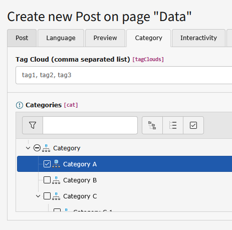

.. ==================================================
.. FOR YOUR INFORMATION
.. --------------------------------------------------
.. -*- coding: utf-8 -*- with BOM.

.. include:: ../Includes.txt

.. _users-manual:

Users manual
============

Target group: **Editors**

.. only:: html

	.. contents:: Within this page
		:local:
		:depth: 3

General information
-------------------

You can write blog posts using the default TYPO3 CMS way: Open the folder or page you set as storagePid using the list module.

Another way to manage posts and comments is t3extblog's simple backend module. It's located in the "web" module section.

.. figure:: ../Images/UserManual/module.png
	:width: 600px
	:alt: Backend module

	Backend module

To write a blog post, just click the plus-icon on the top.

Now you can start adding content to your blog post!

Create a blogpost
-----------------

.. figure:: ../Images/UserManual/createblogpost.png
	:width: 671px
	:alt: Create blogpost

	Create blogost

**Post:**

- Author: is determined by the current BE user
- Title: title of your blog post, you need to fill this field

**Preview:**

- Preview: configure a list preview for the blog post
- There are different "Preview modes", i.e. you can add your own preview text or show the first content element

**Category:**

- Select one or more categories
- You need so select at least one category

**Interactivity:**

- Configure who is allowed to comment
- Trackback options (currently not implemented)

**Metadata:**

- Add some metadata for your blogpost (keywords and description text)
- Metadata tab content is used for SEO relevant meta tags only

**Content:**

- click the 'create new' button (post-tab) to add new content elements
- You can add several content elements

Add categories
^^^^^^^^^^^^^^

You need to add at least one blog category to your post.

	Categorize your post

.. tip::
	New posts are hidden by default, you need to activate them (uncheck "hide" within the access tab)

Create blog categories
----------------------

Use the list module and click the button "create new record", to add categories:

.. figure:: ../Images/UserManual/categories.png
	:width: 223px
	:alt: Add categories

	Add categories

Blog administration
-------------------

The extension comes with an own backend-module. You can find it in the "web" section in the left menu. You can choose
between two sections "posts" and "comments". In the comments-section all pending comments are listed. In the posts-section
all posts are listed, you can add new posts by clicking the "add-icon" above. You see the number of comments too.
When clicking on one of these numbers, all comments corresponding to this blog are shown.

Preview blog posts
------------------

The extension has a preview functionality. It's possible to preview your posts before it's open to the public.
Just keep the blog post hidden and use the "Save document and view page" button (at the top, next to the
"Save and close record" button) within your post records.

Notification emails
-------------------

.. _users-manual-notifications:

This extension comes with two types of subscriptions and there for notification emails.

New comments notification
^^^^^^^^^^^^^^^^^^^^^^^^^

**Admin email**

Simple notification email. Sent to admin when an new comment has been created.

**Subscriber opt-in email**

Confirmation for new subscriber. Sent either when:

- comment is approved by default and not SPAM or
- comment has been approved by an admin

**Notification emails**

New comment notification for all subscribers. Sent if a new comment has been created when:

- comment is approved by default and not SPAM or
- comment has been approved by an admin

.. hint::
	We'are listening for changed or new comments, so sending opt-in and notification emails works from within
	the custom module and the default list module!

New blog posts notification
^^^^^^^^^^^^^^^^^^^^^^^^^^^

**Subscriber opt-in email**

Confirmation for new subscriber. Sent when subscription is created successfully.

**Notification emails**

New comment notification for all subscribers. Use the provided button in BE module to start email sending.
