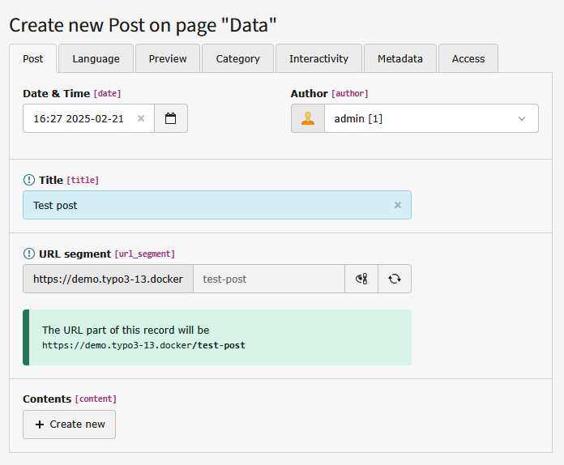

.. ==================================================
.. FOR YOUR INFORMATION
.. --------------------------------------------------
.. -*- coding: utf-8 -*- with BOM.

.. include:: ../Includes.txt

.. _users-manual:

Users manual
============

Write a blogpost
^^^^^

You can write Blogposts using the classic way: Open the folder or page you set for storagePid using the list module, add a new record. If not done already, add at least a title and one category.

But t3extblog comes with an nice backendmodule. You will find it in the "WEB"-section. It will look like this:

.. figure:: ../Images/UserManual/writeblogpost.png
	:width: 600px
	:alt: Backend module

	Backend module

To write an blogpost, just click the plus-icon on the top.

Now you can start adding contents to your blogpost!

	Create blogost

Create blogost
^^^^

- Author: is determined by the existing BE-users
- Title: Title of your blogpost, you need to fill this field
- Your contents: click the 'create new' button to add new content elements
	- A text element is added, you can change it to any other content type
	- You can add more than one content element to a single blogpost

.. figure:: ../Images/UserManual/categorize.png
	:width: 508px
	:alt: categorize post

	categorize your post

- You need to categorize your post (if you don´t have added some categories, take a look below)
- Maybe you want to add some tags
- Important: news posts are hidden by default, you need to activate them (uncheck "hide" at the access tab)

Adding some categories
^^^^^

Use the list view and click the button "create new record", then choose T3Blog Extbase -> categories

.. figure:: ../Images/UserManual/categories.png
	:width: 159px
	:alt: add categories

	add categories

Blog administration
^^^^^

The extension comes with an own backend-module. You can find it in the "web"-section in the left menue. You can choose between two sections "posts" and "comments". In the comments-section all pending comments are listed. In the posts-section all posts are listed, you can add new posts by clicking the "add-icon" above. You see the number of comments too. When clicking on one of these numbers, all comments corresponding to this blog are shown.