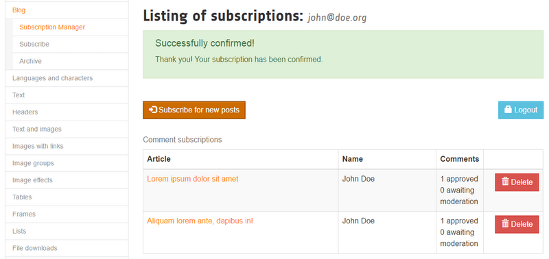
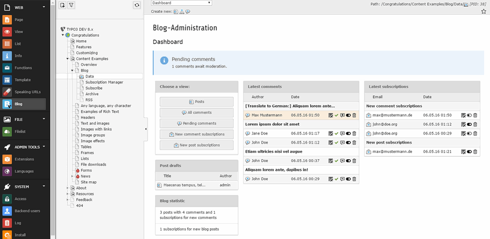

# TYPO3 CMS extension `t3extblog`

A record based blog extension for TYPO3 CMS powered by Extbase / Fluid. Flexible and powerful!

## Screenshots

## Features

Please see [/Documentation/Introduction/Index.rst](./Documentation/Introduction/Index.rst) for currently implemented features.

## Documentation

See [/Documentation](./Documentation) directory or [online](https://docs.typo3.org/p/felixnagel/t3extblog/master/en-us/)

## Installation

Please see [/Documentation/Installation/Full.rst](./Documentation/Installation/Full.rst) for installation.

The extension is available within the [TYPO3 TER](https://extensions.typo3.org/extension/t3extblog/)
or using [composer with packagist](https://packagist.org/packages/felixnagel/t3extblog).

* For TYPO3 10.x use the [master branch](https://github.com/fnagel/t3extblog/tree/master) [(docs)](https://docs.typo3.org/p/felixnagel/t3extblog/master/en-us/)
* For TYPO3 9.x use the [5.x branch](https://github.com/fnagel/t3extblog/tree/5.x) [(docs)](https://docs.typo3.org/p/felixnagel/t3extblog/5.0/en-us/)
* For TYPO3 8.x use the [4.x branch](https://github.com/fnagel/t3extblog/tree/4.x) [(docs)](https://docs.typo3.org/p/felixnagel/t3extblog/4.1/en-us/)
* For TYPO3 7.x use the [3.x branch](https://github.com/fnagel/t3extblog/tree/3.x)
* For TYPO3 6.x use the [2.x branch](https://github.com/fnagel/t3extblog/tree/2.x)
* For migration from old EXT:t3blog see [migration guide](./Documentation/ReplaceT3Blog/Index.rst)

## Feature requests & bug reports

Please see Github: [github.com/fnagel/t3extblog/issues](https://github.com/fnagel/t3extblog/issues)

## Changelog

Please see Github: [github.com/fnagel/t3extblog/commits](https://github.com/fnagel/t3extblog/commits)

## Contribution

Please see [/.github/CONTRIBUTING.md](./.github/CONTRIBUTING.md)

## Donation

Please consider a donation: [www.felixnagel.com/donate/](http://www.felixnagel.com/donate/)
